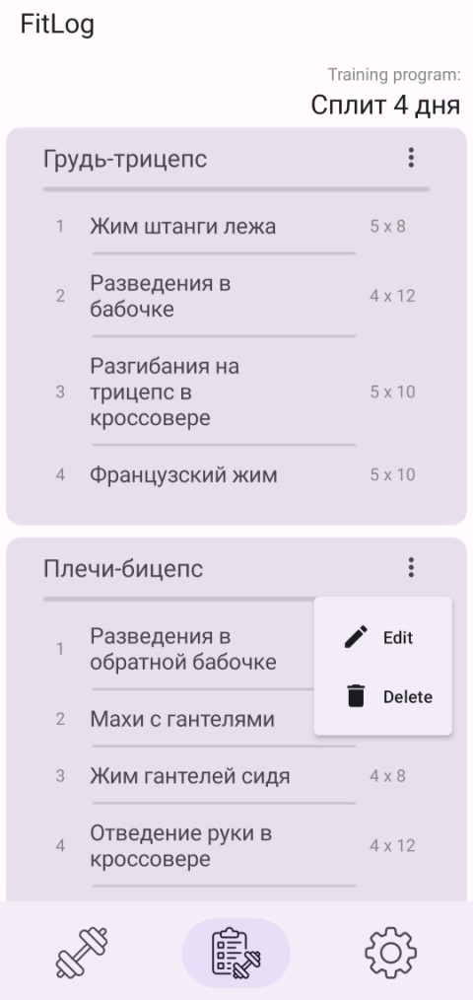

# Описание
FitLog - мобильное andriod приложение, которое позволяет составлять и хранить силовые тренировочные программы. Больше не нужно листать заметки в спортивном зале или носить с собой блокнот и ручку - FitLog подскажет, какие упражнения сегодня нужно сделать, сколько осталось подходов и как долго можно отдохнуть до следующего упражнения.
## Подробное описание
Приложение дает возможность собственноручно составить тренировочный план (задать название программы и ее описание), добавить нужное количество тренировочных дней, в каждый из тренировочных дней добавить любые упражнения (есть возможность использования как пользовательских параметров, так и параметров по умолчанию для колличества подходов, повторений и времени отдыха для каждого упражнения).

Тренировочный экран упражнения позволяет запустить любой из тренировочных дней программы. После запуска отображет предстоящие упражнения, а также колличество подходов для каждого упражнения. После выполнения очередного подхода, пользователь нажимает на кнопку выполеного подхода, после чего запускается таймер, отсчитывающий время отдыха в соответствии с указаным параметром при составлении программы.
# Структура проекта
Приложение написано с использоваинем clean-архитектуры, и разделено на модули:
1. App
2. Domain
3. Data

Используются паттерны репозиторий и MVVM.

  
Диаграмма архитектуры

    

# Стек проекта
Kotlin, Jetpack Compose, Room, Koin, Coroutines, Compose Navigation.

# Скриншоты приложения

  
Скриншоты

  
  
  
  
  

# Инструкция по установке
Для установки необходимо скачать файл FilLog.apk, лежащий в корневой директории проекта, и установить приложение на устройство с Android OS.
